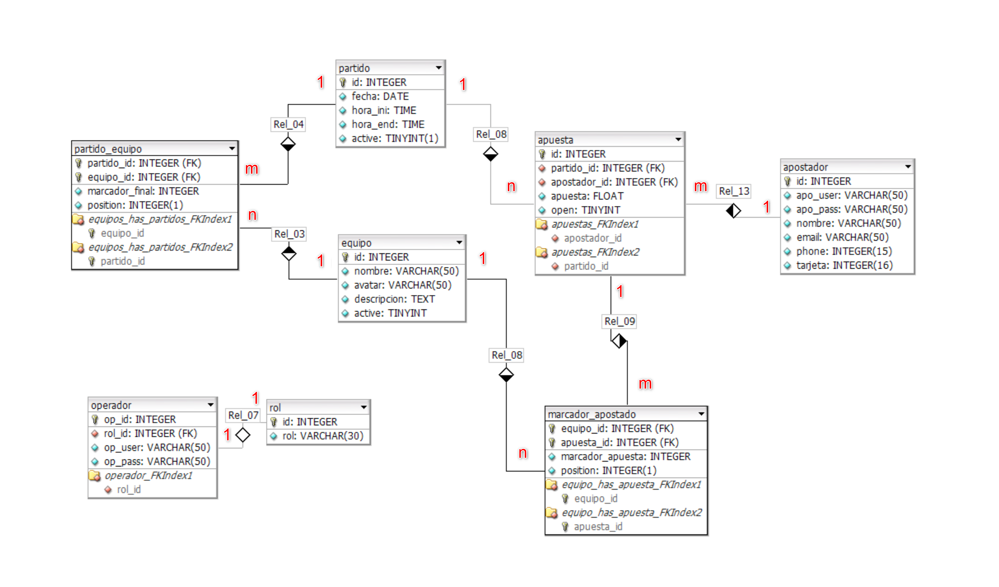
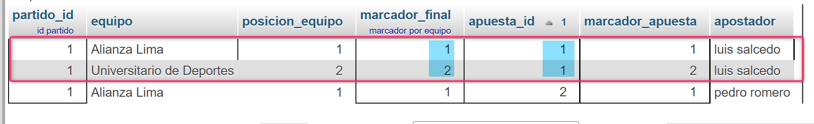

# Práctica apuestas SQL

- ## [Ver archivo SQL](./assets/apuestas_sql)

<br><br>

## Gráfico MER

---


<br><br><br>

## Consultas

---

### 1) Consultar partidos activos, los equipos que juegan y sus marcadores finales

```sql
SELECT partido_id, equipo_id ,equipo.nombre, marcador_final, position
FROM partido
INNER JOIN partido_equipo
INNER JOIN equipo
WHERE partido.active = 1

AND partido.id = partido_equipo.partido_id
AND equipo.id = partido_equipo.equipo_id
```

### 2) Buscando las apuestas del partido activo (partido.id = 1), con el nombre de los apostadores y la cantidad que apostaron

```sql
SELECT partido_id,apuesta.id AS apuesta_id,apuesta, apostador.nombre
FROM apuesta
INNER JOIN apostador
WHERE apuesta.partido_id = 1

AND apostador.id = apuesta.apostador_id
```

### 3) Extreyendo el marcador apostado por equipo por cada apuesta

```sql
SELECT partido_id, equipo_id, equipo.nombre, position, apuesta, apostador.nombre, marcador_apuesta
FROM partido
INNER JOIN apuesta
INNER JOIN marcador_apostado
INNER JOIN equipo
INNER JOIN apostador
WHERE partido.active = 1

AND partido.id = apuesta.partido_id
AND apuesta.id = marcador_apostado.apuesta_id
AND equipo.id = marcador_apostado.equipo_id
AND apostador.id = apuesta.apostador_id
```

### 4) Comparando marcador apostado con el marcador final

```sql
SELECT partido_id, equipo.nombre as equipo, partido_equipo.marcador_final, apuesta_id, marcador_apuesta, apostador.nombre as apostador
FROM partido_equipo
INNER JOIN marcador_apostado
INNER JOIN apostador
INNER JOIN equipo
WHERE partido_equipo.partido_id = 1

AND partido_equipo.equipo_id = marcador_apostado.equipo_id
AND partido_equipo.marcador_final = marcador_apostado.marcador_apuesta
AND apostador.id = marcador_apostado.apuesta_id
AND equipo.id = marcador_apostado.equipo_id
ORDER BY apuesta_id ASC
```

### 5) Todo resumido en una consulta

```sql
SELECT apuesta.partido_id, equipo.nombre as equipo, partido_equipo.marcador_final, apuesta_id, marcador_apuesta, apostador.nombre as apostador, apuesta.apuesta
FROM partido_equipo
INNER JOIN marcador_apostado
INNER JOIN apostador
INNER JOIN apuesta
INNER JOIN equipo
WHERE partido_equipo.partido_id = 1

AND partido_equipo.equipo_id = marcador_apostado.equipo_id
AND partido_equipo.marcador_final = marcador_apostado.marcador_apuesta
AND apostador.id = marcador_apostado.apuesta_id
AND equipo.id = marcador_apostado.equipo_id
AND apuesta.id = marcador_apostado.apuesta_id
ORDER BY apuesta_id ASC
```

<br>

<br><br>

## GANADOR

---


