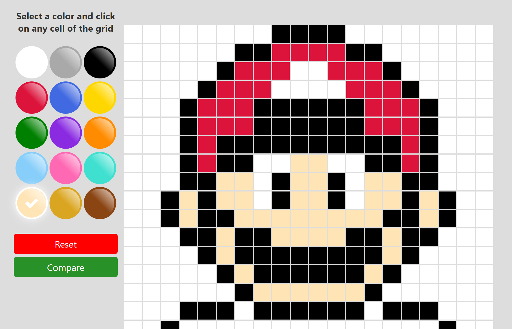

# Proyectos React

- ## Opción 1 - [fake-store](./fake-store)


<br><br><br>

- ## Opción 2 - [color-selector](./color-selector)

<br><br><br>

# Preguntas

## 1) ¿Cuáles son las ceremonias más importantes de un Sprint y cuál es la idea de cada una?

_Respuesta:_

- _sprint planning_: Es la reunión donde da inicio un sprint. Aquí el equipo se compromete con una serie de entregables y se identifican las tareas que se deben completar para cumplir con ellas.
- _daily scrum_: Reunión muy corta, al inicio del día, donde cada participante cuenta qué items ha completado.
- _story time_: Es una reunión programada a mitad de semana generalmente, con el fin de discutir y mejorar las historias de usuario de futuros sprints.
- _sprint review_: Es la reunión que marca el final del sprint. Se revisan los items que se terminaron y los que no se terminaron.
- _retrospective_: Esta es una reunión interna del equipo, generalmente después de la revisión del sprint en donde se identifican uno o dos cambios estratégicos para el siguiente sprint.

## 2) ¿Qué son los Wireframes? Nombra al menos una herramienta que podamos utilizar.

_Respuesta:_

El wireframe es una guía visual que representa el esqueleto o estructura visual de un sitio web.​

Una de las principales funciones es de ahorrar tiempo y dinero porque lleva poco tiempo hacerlo y aporta mucho valor informativo.

### Herramientas:

- Figma
- Adobe XD
- Sketch (macOS), entre otros.

## 3) Explicar la diferencia entre var, let y const. Y dar un ejemplo en qué caso se utilizará.

_Respuesta:_

- var: Es la palabra reservada con la que declaramos una variable, es decir, que podemos reasignarle un nuevo valor y podemos acceder a ella dentro de un alcance de función (función scope).

```javascript
if (true) {
  var str = "hola mundo";
  str = "chao mundo";
  console.log(str); // chao mundo
}
console.log(str); // chao mundo
```

- let: Es la palabra reservada con la que declaramos una variable, es decir, que podemos reasignarle un nuevo valor y podemos acceder a ella dentro de un alcance de bloque (block scope), vale decir, dentro de un bloque de llaves (if, for, while, etc).

```javascript
if (true) {
  let str = "hola mundo";
  str = "chao mundo";
  console.log(str); // chao mundo
}
console.log(str); // str is undefined
```

- const: Es la palabra reservada con la que declaramos una constante, es decir, que el valor de esta no puede ser cambiado una vez sea declarado. Podemos acceder a ella dentro de un alcance de bloque (block scope), vale decir, dentro de un bloque de llaves (if, for, while, etc).

```javascript
if (true) {
  const str = "hola mundo";
  console.log(str); // hola mundo
}
console.log(str); // str is undefined
```

```javascript
if (true) {
  const str = "hola mundo";
  str = "chao mundo"; // Error
  console.log(str);
}
```

## 4) ¿Cuáles son los tres comandos que se pueden utilizar para crear una nueva rama llamada rama-1?

_Respuesta:_

Para crear una nueva rama usamos 2 comandos de git, el primero para crear la rama y el segundo para posicionarnos sobre ella

```
git branch rama-1
git checkout rama-1
```

La otra forma de crear una rama y posicionarse sobre ella, es utilizando el comando:

```
git checkout -b rama-1
```

## 5) Explicar la diferencia entre git merge y git rebase.

_Respuesta:_

### Git Merge

- Crea un nuevo commit donde se evidencia la integración de las ramas.
- No se pierde la historia del commit, queda intacto.
- Sí se sabe el autor real de cada commit.
- No importa el número de commit que hubo antes, se hace solo una vez.

### Git Rebase

- No se crea un nuevo commit por cada rebase.
- La historia del commit cambia y crea una especie de duplicado.
- No se sabe el autor real de los commits.
- Si hubo n commits se debe iterar n veces sobre el rebase.

## 6) ¿Cuál es la diferencia entre Pull Request (PR) y el comando git pull?

_Respuesta:_

- Pull Request: Es un mecanismo para solicitar, revisar y discutir los cambios que se van a integrar sobre una rama.

- Git pull: Es un comando para actualizar una rama local con una rama remota (en primer lugar ejecuta git fetch y después se ejecuta git merge).

## 7) ¿Qué es el Virtual DOM?

_Respuesta:_

En React el virtualDOM (VDOM) es una copia del DOM (que contiene todos los elementos de la aplicación).

Al ser una copia, cuando se actualiza el estado en React, hace una comparación del nuevo virtual VDOM con el anterior, y si encuentra cambios solo actualiza lo que cambio en el Real DOM (RDOM).

## 8) Dado el siguiente [codePen](https://codepen.io/cristian-makeitreal/pen/NWadqqa?editors=1100), el cual solo tiene un HTML, por medio de css llegar a esta respuesta. [Imagen](https://github.com/makeitrealcamp/assesment-1-programa-top/blob/main/assets/services-section.gif). (Para mostrar los servicios debes usar CSS Flexbox o CSS Grid).

_Respuesta:_

Para este ejercicio se puede llegar a resultados similares usando cualquiera de los 2.
Solo cabe mencionar que grid te da más facilidad en definir los espacios entre columnas y filas (lo que en diagramación llamamos medianiles) usando column-gap y row-gap.

### 👨🏻‍💻 Usando grid

(Para probar, copiar y pegar código en el codePen)

```css
@import url("https://fonts.googleapis.com/css2?family=Crimson+Pro:wght@400;500;600&display=swap");

h1,
h2,
h3,
h4,
h5 {
  font-family: "Crimson Pro", serif;
}
body {
  font-size: 16px;
  font-family: sans-serif;
  color: #333;
}
ul {
  padding: 0;
  margin: 0;
}
.c-section {
  max-width: 780px;
  position: relative;
  margin: auto;
}
.c-section__title {
  font-size: 2em;
  background: #242529;
  padding: 25px 30px;
  text-align: center;
  color: #fff;
  border-top: solid 10px #b6b7b6;
}
.c-services {
  display: grid;
  grid-template-columns: 1fr 1fr;
  column-gap: 15px;
  row-gap: 5px;
}
.c-services__item {
  list-style: none;
  background: #f7f7f7;
  margin: 0 0 10px 0;
  box-sizing: border-box;
  padding: 5px 20px;
  transition: all 0.2s ease;
  font-size: 0.85em;
  line-height: 1.5em;
  font-weight: 550;
  letter-spacing: -0.03em;
}
.c-services__item h3 {
  font-size: 1.6em;
  padding: 5px 0 5px 40px;
}
.c-services__item:hover {
  box-shadow: 0 5px 5px rgba(0, 0, 0, 0.2);
}

@media (max-width: 560px) {
  .c-services {
    display: block;
  }
}
```

### 👨🏻‍💻 Usando flexbox

(Para probar, copiar y pegar código en el codePen)

```css
@import url("https://fonts.googleapis.com/css2?family=Crimson+Pro:wght@400;500;600&display=swap");

h1,
h2,
h3,
h4,
h5 {
  font-family: "Crimson Pro", serif;
}
body {
  font-size: 16px;
  font-family: sans-serif;
  color: #333;
}
ul {
  padding: 0;
  margin: 0;
}
.c-section {
  max-width: 780px;
  position: relative;
  margin: auto;
}
.c-section__title {
  font-size: 2em;
  background: #242529;
  padding: 25px 30px;
  text-align: center;
  color: #fff;
  border-top: solid 10px #b6b7b6;
}
.c-services {
  display: flex;
  flex-wrap: wrap;
  justify-content: space-between;
}
.c-services__item {
  width: 49.5%;
  list-style: none;
  background: #f7f7f7;
  margin: 0 0 10px 0;
  box-sizing: border-box;
  padding: 5px 20px;
  transition: all 0.2s ease;
  font-size: 0.85em;
  line-height: 1.5em;
  font-weight: 550;
  letter-spacing: -0.03em;
}
.c-services__item h3 {
  font-size: 1.6em;
  padding: 5px 0 5px 40px;
}
.c-services__item:hover {
  box-shadow: 0 5px 5px rgba(0, 0, 0, 0.2);
}

@media (max-width: 560px) {
  .c-services {
    display: block;
  }
  .c-services__item {
    width: inherit;
  }
}
```
