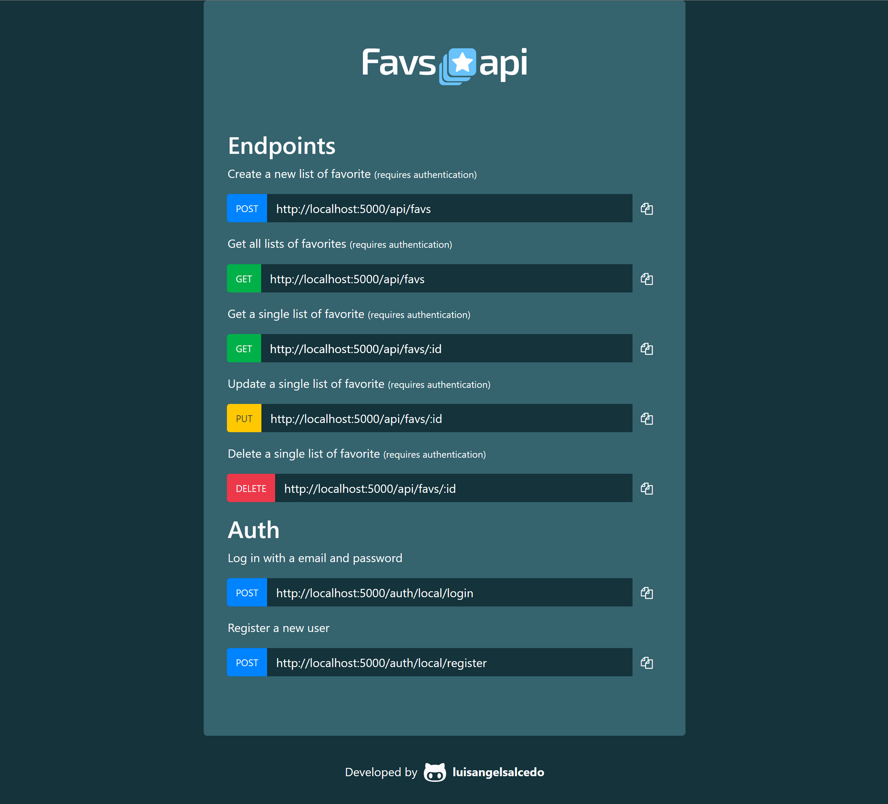
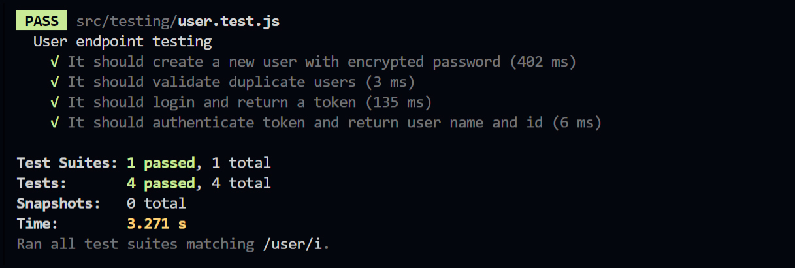
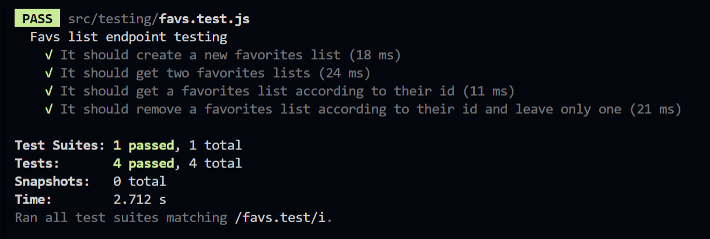
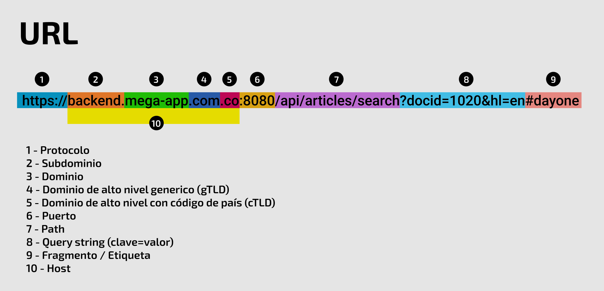

## favs-backend

<div>
&nbsp;&nbsp;
&nbsp;&nbsp;
&nbsp;&nbsp;
&nbsp;&nbsp;&nbsp;
&nbsp;&nbsp;
&nbsp;&nbsp;
&nbsp;&nbsp;
&nbsp;&nbsp;
&nbsp;&nbsp;
&nbsp;&nbsp;
&nbsp;&nbsp;
</div>

### [Repositorio](https://github.com/luisangelsalcedo/bootcamp-challenges/tree/main/assesment2/favs-backend) &nbsp;&nbsp;|&nbsp;&nbsp; [Deploy](https://favs-backend.herokuapp.com/)

<br>


## Run test environment

**Bash:**

```bash
npm install
npm run dev-test
```

**Other Bash:**

```bash
npm run test
```

### User testing



### Favs testing



---

## Questions

### 1. Indicate which are the parts of the following url: `https://backend.mega-app.com.co:8080/api/articles/search?docid=1020&hl=en#dayone`

   

- 1 - Protocolo (`https://`)
- 2 - Subdominio (`backend.`)
- 3 - Dominio (`mega-app`)
- 4 - Dominio de alto nivel generico - gTLD (`.com`)
- 5 - Dominio de alto nivel con código de país - cTLD (`.co`)
- 6 - Puerto (`:8080`)
- 7 - Path (`/api/articles/search`)
- 8 - Query string (`?docid=1020&hl=en`)
- 9 - Fragmento / Etiqueta (`#dayone`)
- 10 - Host (`backend.mega-app.com.co`)

---

### 2. Define what is a Web API, Restful and what are the statusCode 200-, 400-, 500-

- Un Web API es un tipo de API que utiliza el protocolo HTTP como forma de comunicación.
- Restful es la implementación de la arquitectura Rest para conectar varios sistemas basados en el protocolo HTTP.
- StatusCode `200`: La solicitud ha tenido éxito.
- StatusCode `400`: Esta respuesta significa que el servidor no pudo interpretar la solicitud dada una sintaxis inválida.
- StatusCode `500`: El servidor ha encontrado una situación que no sabe cómo manejarla.

---

### 3. When we talk about `CRUD`, what does it mean?

El CRUD se refiere a un acrónimo formado por las primeras letras de las cuatro operaciones más importantes para la creación y gestión de una base de datos.

Sirve para crear (`create`), leer (`read`), actualizar (`update`) y eliminar (`delete`) información usando los verbos de HTTP.

---
