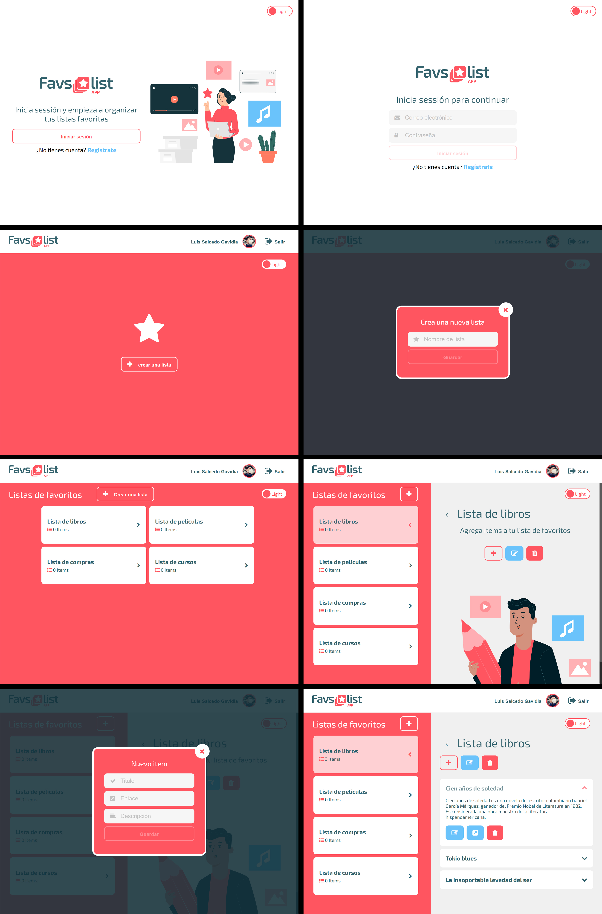

## favs-frontend

&nbsp;&nbsp;
&nbsp;&nbsp;
&nbsp;&nbsp;
&nbsp;&nbsp;
&nbsp;&nbsp;
&nbsp;&nbsp;
&nbsp;&nbsp;

### [Repositorio](https://github.com/luisangelsalcedo/bootcamp-challenges/tree/main/assesment2/favs-frontend) &nbsp;&nbsp;|&nbsp;&nbsp; [UI Design](https://www.figma.com/file/Z2gIl93XMtpLRUHsEBDKOS/favsApp?node-id=0%3A1) &nbsp;&nbsp;|&nbsp;&nbsp; [Deploy](https://favs-app-luissg.netlify.app/)

 

