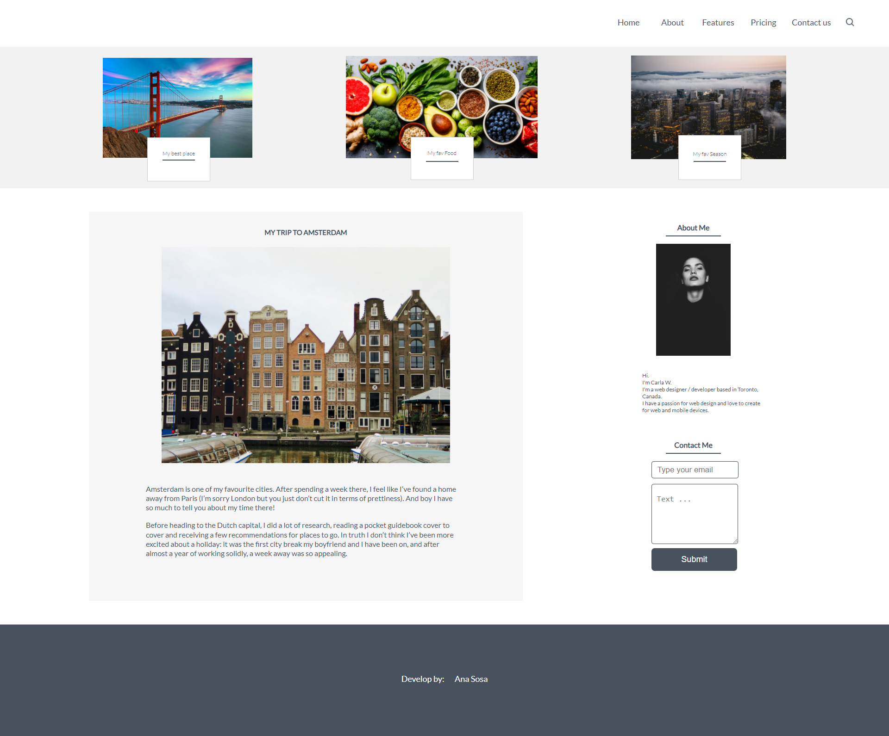
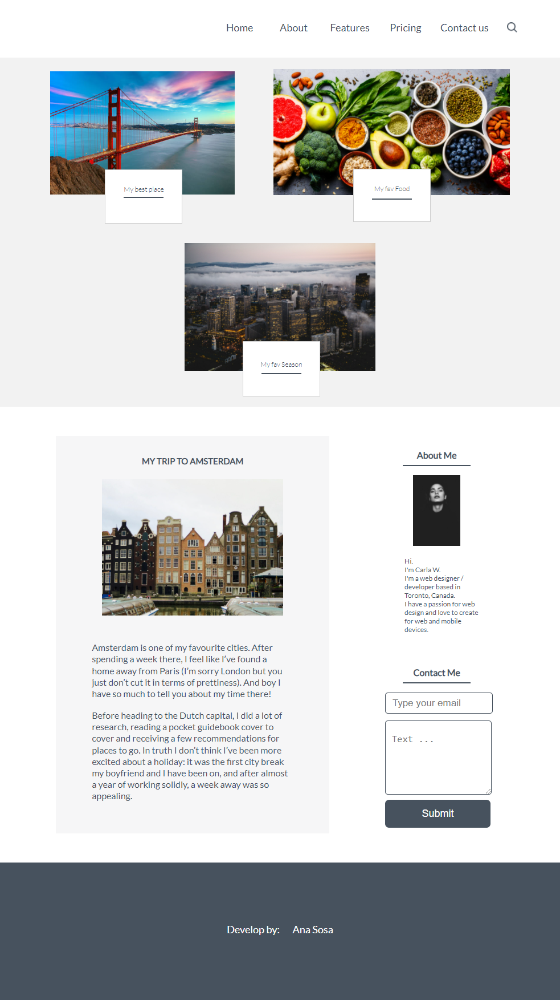

# Blog Layout

1. Crear el layout del blog utilizando HTML semántico, para el banner de arriba puedes utilizar flexbox. 
2. Fuente: [Lato](https://fonts.google.com/specimen/Lato)
3. Imágenes: Dentro de la carpeta [images/](images)
4. Los textos están [aquí](textos.md)
5. En el Developed By, escriben el nombre de cada uno

Nota: Los links del menú no es necesario que vayan a alguna página por el momento, los mismo con el formulario, solo será la maquetación.

## Trabajo grupal en clase
* [Erick del Castillo](https://github.com/mrff88)
* [Luis Salcedo](https://github.com/luisangelsalcedo)
* [Martin Cruz](https://github.com/martincruzot)
* [Renzo Manrique](https://github.com/RenzoEMH)

