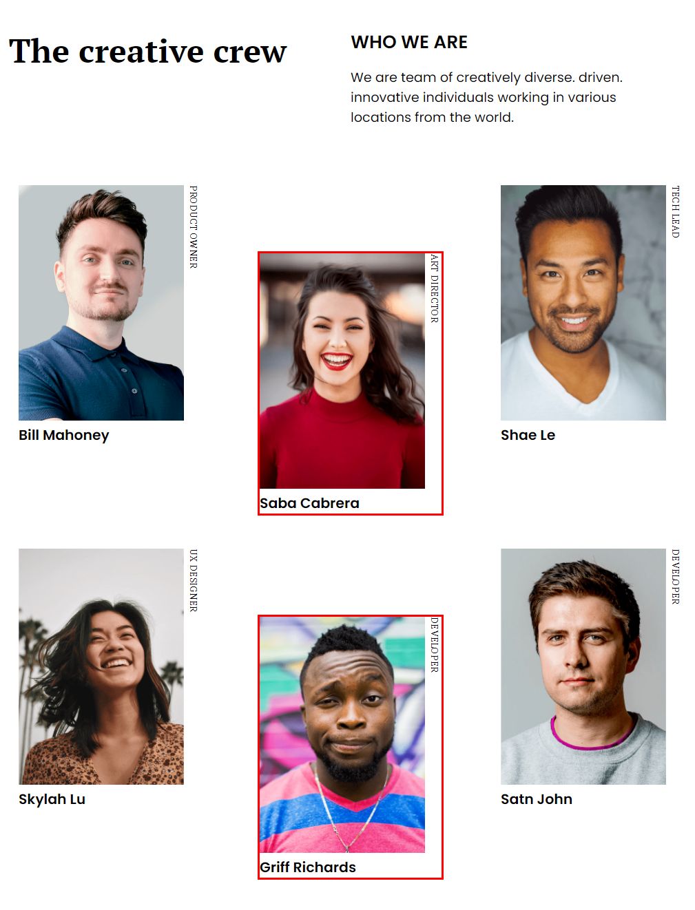

# My-team-page CSS

[VER DEMO](http://www.luissg.com/bootcamp/my-team-page/)

## fuentes usadas (Google Font)
* PT Serif
* Poppins
* Montserrat

```css
@import url('https://fonts.googleapis.com/css2?family=Montserrat:wght@500;700&family=PT+Serif:wght@400;700&family=Poppins:wght@400;600&display=swap');

{
    font-family: 'Montserrat', sans-serif;
    font-family: 'Poppins', sans-serif;
    font-family: 'PT Serif', serif;
}
```

## Miembro del equipo (.member)
El contenedor de cada miembro del equipo tiene <code>position: relative;</code> (border rojo) para encerrar el div del cargo (border azul) que es <code>position: absolute;</code> y esta rotado en 90 grados con la propiedad <code>transform: rotate(90deg);</code>


**HTML**
```html
<div class="member">
    <position class="job-position">PRODUCT OWNER</position>
    
    <name class="name">Bill Mahoney</name>
</div>
```

**CSS**
```css
.team .member{ 
    width: 8rem;
    position: relative;
    padding-right: 1rem;
}
.team .member img{
    width: 100%;
    height: auto;
}
.team .member .job-position{
    position: absolute;
    z-index: 2;
    width: 100%;
    transform: rotate(90deg);
    transform-origin: 0 0;
    left: 100%;
}
.team .member .name{

}
```
<br><br>

## Contendor Team (.team) - 2 columnas

El contenedor principal esta ultilizando **flex-box** con <code>flex-wrap: wrap;</code> para encajar el contenido dentro del div.

**CSS**
```css
.team{
    display: flex;
    flex-wrap: wrap;
    justify-content: center;
}
```

Cuando el contenido esta en dos columnas, usamos <code>:nth-of-type(2n)</code> para hacer descender solo los contenedores **.member** pares usando <code>margin-top</code>.

**CSS**
```css
.team .member:nth-of-type(2n){
    margin-top: 3rem;
}
```

<br><br>

## Contendor Team (.team) - 3 columnas

Cuando el contenido esté en tres columnas, reseteamos los **margin** usando <code>margin-top: 0 !important;</code>
y seleccionamos desde **segundo elemento** cada 3 (2, 5, 8, 11) usando <code>:nth-child(3n+2)</code> y le aplicamos <code>margin-top: 4rem !important;</code>  

**CSS**
```css
.team .member:nth-child(3n+2){
    margin-top: 4rem !important;
}
```

