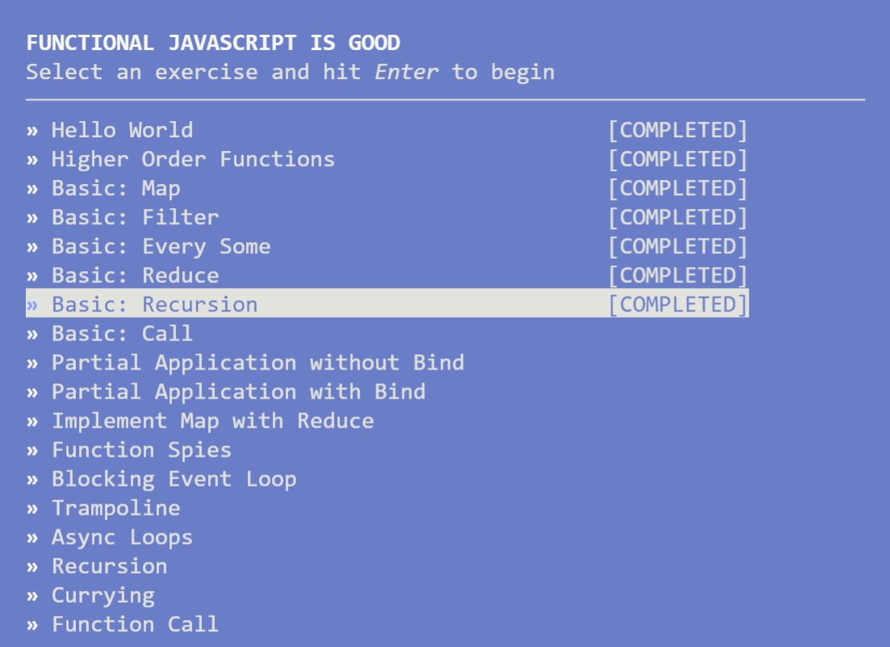

# NODESCHOOL - [Functional javascript](https://github.com/timoxley/functional-javascript-workshop)

Aprende acerca de las características fundamentales de la programación funcional de JavaScript en puro ES5.

## Run: [functionalJS.js](functionalJS.js)

<br>

 

<br><br>


## 01) Hello World
### Task:
Write a function that takes an input string and returns it uppercased.
### Arguments:
* input: a String of random words (lorem ipsum).
### My solution:
```js
function upperCaser(input) {
    let result = input.toUpperCase();
    return result;
}
module.exports = upperCaser  
```
---
<br>

## 02) Higher Order Functions
### Task:
Implement a function that takes a function as its first argument, a number num as its second argument, then executes the passed in function num times.
### Arguments:
* operation: A Function, takes no arguments, returns no useful value.
* num: the number of times to call `operation`
### Hints
* Don't overthink it, the code should be rather simple.
* It's ok to use a loop in your implementation, bonus points if you use recursion instead.
* You may notice some output. That is coming from the function we passed you.
* You do not need to console.log anything.
### My solution:
```js
function repeat(operation, num) {
    if(num <= 0) return;
    return repeat(operation, num-1);
}
module.exports = repeat  
```
---
<br>

## 03) Basic: Map
### Task:
Convert the following code from a for-loop to Array#map:
```js
function doubleAll(numbers) {               
    var result = []                           
    for (var i = 0; i < numbers.length; i++) {
        result.push(numbers[i] * 2)             
    }                                         
    return result                             
}                         
```
### Arguments:
* numbers: An Array of 0 to 20 Integers between 0 and 9
### Conditions
* Your solution should use Array.prototype.map()            
* Do not use any for/while loops or Array.prototype.forEach.
* Do not create any unnecessary functions e.g. helpers.
### My solution:
```js
function doubleAll(numbers) {
    return numbers.map(n => n*2);
}
module.exports = doubleAll
```
---
<br>

## 04) Basic: Filter
### Task:
Use Array#filter to write a function called `getShortMessages`.

`getShortMessages` takes an array of objects with `.message` properties and returns an array of messages that are less than < 50 characters long.
The function should return an array containing the messages themselves, without their containing object.
### Arguments:
*  messages: an Array of 10 to 100 random objects that look something like this:
```js                                                                          
{                                                                            
   message: 'Esse id amet quis eu esse aute officia ipsum.' // random         
}                                                                            
```
### Conditions
* Do not use any for/while loops or Array#forEach.
* Do not create any unnecessary functions e.g. helpers.  
### Hint
* Try chaining some Array methods!                                                                     
### My solution:
```js
function getShortMessages(messages) {
    return messages.filter(({message}) => message.length < 50).map(x => x.message); 
}
module.exports = getShortMessages
```
### Official solution
```js
module.exports = function getShortMessages(messages) {
    return messages.filter(function(item) {
        return item.message.length < 50
    }).map(function(item) {
        return item.message
    })
}
module.exports = getShortMessages
```
---
<br>

## 05) Basic: Every Some
### Task:
Return a function that takes a list of valid users, and returns a function that returns true if all of the supplied users exist in the original list of users.

You only need to check that the ids match.
### Example:
```js
                                                   
 var goodUsers = [                                 
   { id: 1 },                                      
   { id: 2 },                                      
   { id: 3 }                                       
 ]                                                 
                                                   
 // `checkUsersValid` is the function you'll define
 var testAllValid = checkUsersValid(goodUsers)     
                                                   
 testAllValid([                                    
   { id: 2 },                                      
   { id: 1 }                                       
 ])                                                
 // => true                                        
                                                   
 testAllValid([                                    
   { id: 2 },                                      
   { id: 4 },                                      
   { id: 1 }                                       
 ])                                                
 // => false                                       
```
### Arguments:
* goodUsers: a list of valid users
### Conditions:
* Do not use any for/while loops or Array#forEach.
* Do not create any unnecessary functions e.g. helpers.
### My solution:
```js
function checkUsersValid(goodUsers) {
  return function allUsersValid(submittedUsers) {
    return submittedUsers.every(({id:ids})=>{
      return goodUsers.some(({id:idg})=>{
        return idg === ids;
      });
    });
  };
}
module.exports = checkUsersValid
```
### Official solution
```js
module.exports = function checkUsersValid(goodUsers) {
    return function allUsersValid(submittedUsers) {
        return submittedUsers.every(function(submittedUser) {
            return goodUsers.some(function(goodUser) {
                return goodUser.id === submittedUser.id
            })
        })
    }
}
module.exports = checkUsersValid
```
---
<br>

## 06) Basic: Reduce
### Task:
Given an Array of strings, use Array#reduce to create an object that contains the number of times each string occured in the array. Return the object directly (no need to console.log).
### Example:
```js
var inputWords = ['Apple', 'Banana', 'Apple', 'Durian', 'Durian', 'Durian']

console.log(countWords(inputWords))
// =>
// {
//   Apple: 2,
//   Banana: 1,
//   Durian: 3
// }
```
### Arguments:
* inputWords: An array of random Strings.
### Conditions:
* Do not use any for/while loops or Array#forEach.
* Do not create any unnecessary functions e.g. helpers.
### My solution:
```js
function countWords(inputWords) {
    return inputWords.reduce((valorInicial, valorActual)=>{

        valorInicial[valorActual] = (!valorInicial[valorActual]) ? 1 : valorInicial[valorActual]+1;
        // if(!valorInicial[valorActual]) valorInicial[valorActual] = 1;
        // else valorInicial[valorActual] += 1;

        return valorInicial;
    },{})
}
module.exports = countWords
```
### Official solution:
```js
function countWords(arr) {
    return arr.reduce(function(countMap, word) {
        countMap[word] = ++countMap[word] || 1 // increment or initialize to 1
        return countMap
    }, {}) // second argument to reduce initialises countMap to {}
}

module.exports = countWords
```
---
<br>

## 07) Basic: Recursion
### Task:
Implement Array#reduce using recursion.
To test your reduction works correctly we will use your reduce implementation to execute our solution to the previous basic_reduce problem. i.e. your reduce function will be passed an array of words, and a function, and an initial value which will return an object containing the counts for each word found in the array. You don't need to implement this functionality, it will be supplied to your reduce implementation.
For simplicity, your implementation of reduce need not replicate the behaviour of a reduce missing an initial value. You may assume the initial value will always be supplied.

### Arguments:
* arr: An Array to reduce over
* fn: Function to use as the reduction step. Like regular Array#reduce, this function must be passed previousValue, currentValue, index and the array we're iterating over.
* init: Initial value of the reduction. Unlike Array#reduce, this value is required (and you may assume it will always be supplied).

### Example: 
```js
// Your reduce function should behave the same as a
// regular Array#reduce, but it will take the array
// to operate on as the first argument:

reduce([1,2,3], function(prev, curr, index, arr) {
    return prev + curr
}, 0)
// => 6
```

### Conditions
* Do not use any for/while loops.
* Do not use any Array methods like Array#map or Array#reduce.

### My solution:
```js
function reduce(arr, fn, initial) {
// SOLUTION GOES HERE

    if(!arr.length) return initial;  
    const [first, ...rest] = arr;
    initial = fn(initial,first,rest.length,rest);  
    return reduce(rest,fn,initial);
}
module.exports = reduce
```

### Official solution
```js
function reduce(arr, fn, initial) {
    return (function reduceOne(index, value) {
        if (index > arr.length - 1) return value // end condition
        return reduceOne(index + 1, fn(value, arr[index], index, arr)) // calculate & pass values to next step
    })(0, initial) // IIFE. kick off recursion with initial values
}
module.exports = reduce
```
---
<br>

## 08) Basic: Call
---
<br>

## 09) Partial Application without Bind
---
<br>

## 10) Partial Application with Bind
---
<br>

## 11) Implement Map with Reduce
---
<br>

## 12) Function Spies
---
<br>

## 13) Blocking Event Loop
---
<br>

## 14) Trampoline
---
<br>

## 15) Async Loops
---
<br>

## 16) Recursion
---
<br>

## 17) Currying
---
<br>

## 18) Function Call
---
<br>
