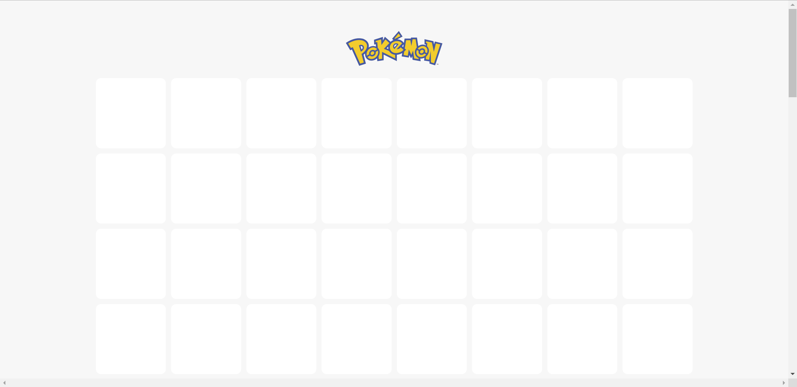
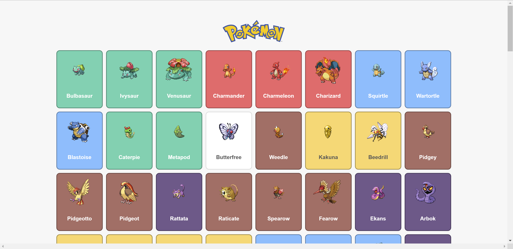
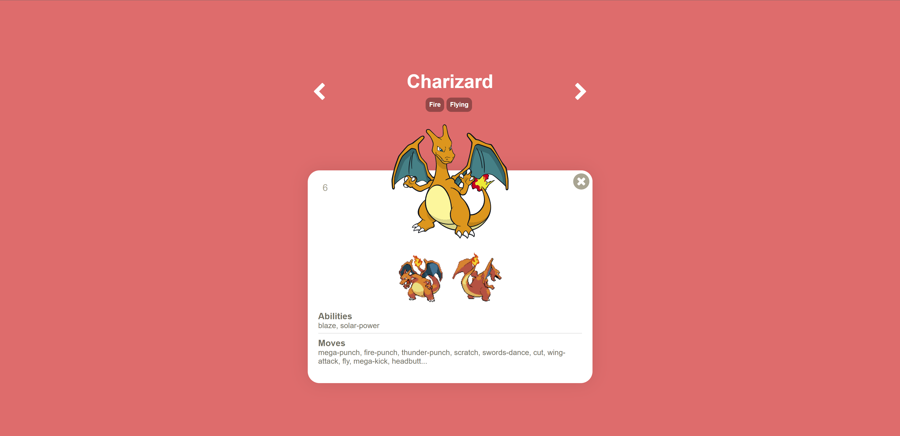
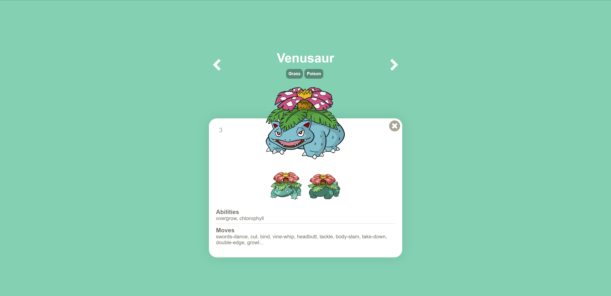

# PokedexJs

Usando [PokeApi v2](https://pokeapi.co/) para mostrar una lista de pokemons que al darle clic abrirá un modal con el detalle del pokemon seleccionado.

---

## <a href='https://luisangelsalcedo.github.io/pokedex/' target='_blank'>Deploy</a>

---

## Precarga

## Pokemons List

## Modal

