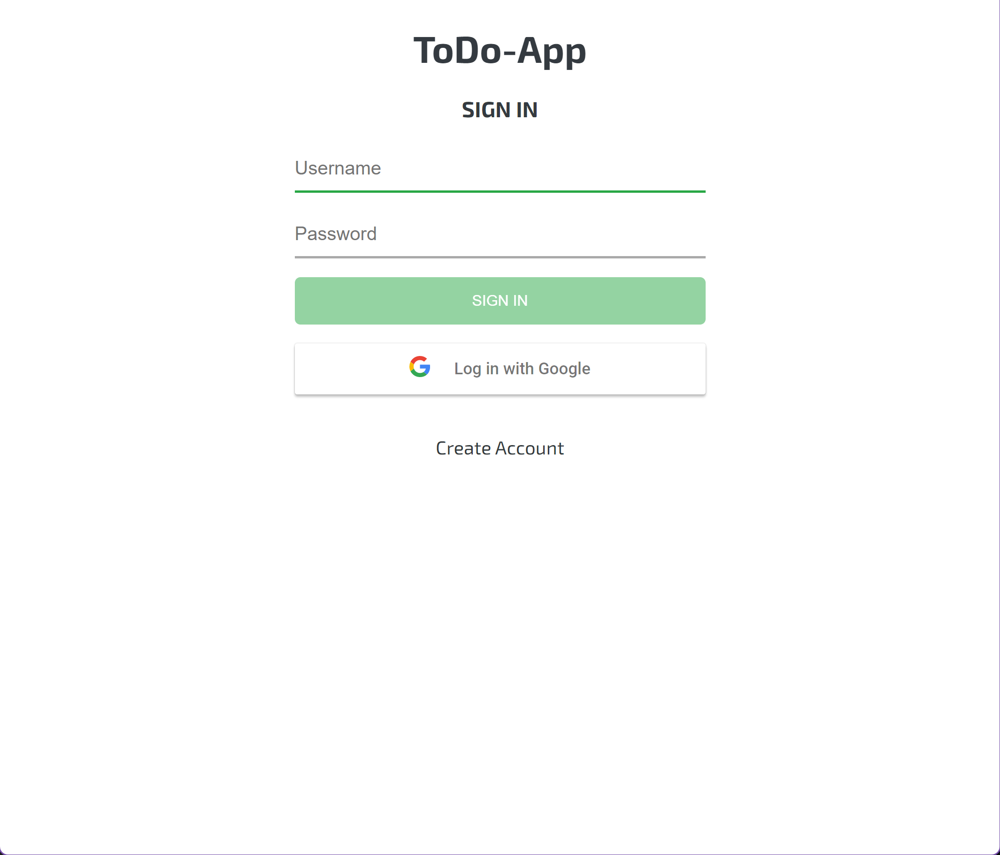
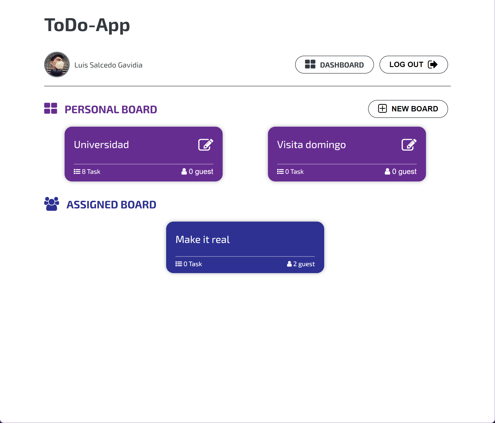
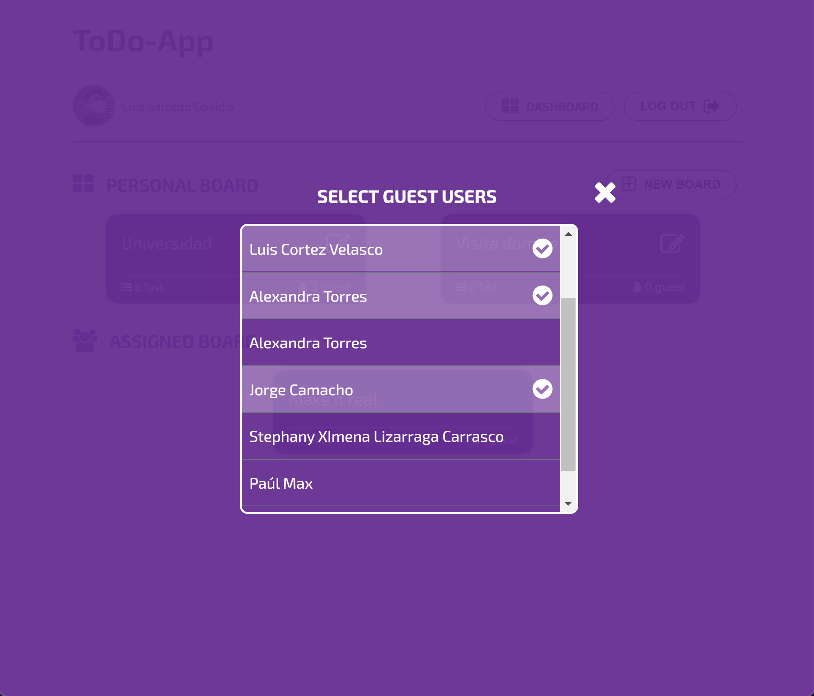
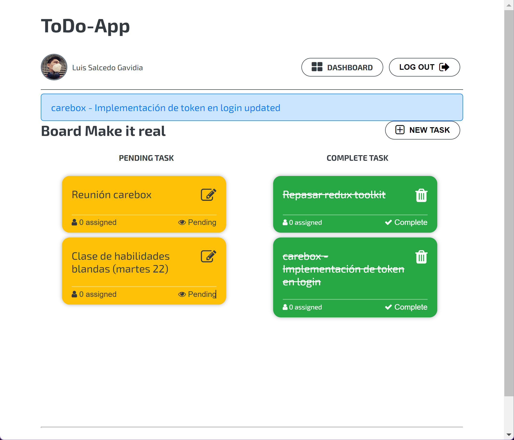
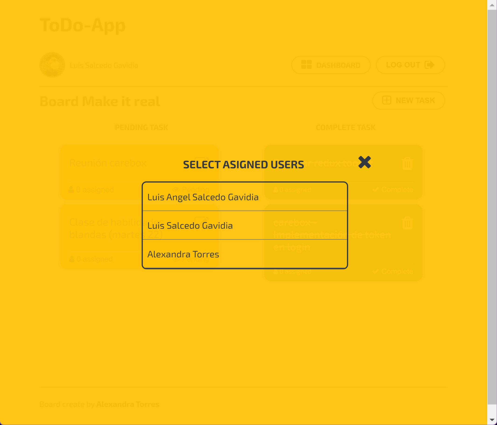

# CRUD ToDo

---

### Deploy:

[BACKEND](https://task-backend-luisangelsalcedo.herokuapp.com/) - [FRONTEND](https://tasks-app-luissg.netlify.app/)

---

## LOGIN

---

## DASHBOARD

---

## ADD GUESTS TO BOARD

---

## TASKS

---

## ADD ASSINGED

---
